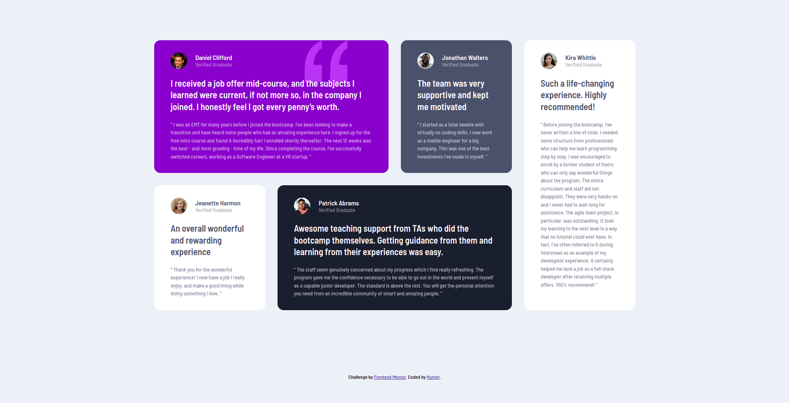

# Frontend Mentor - Testimonials grid section solution

This is a solution to the [Testimonials grid section challenge on Frontend Mentor](https://www.frontendmentor.io/challenges/testimonials-grid-section-Nnw6J7Un7). Frontend Mentor challenges help you improve your coding skills by building realistic projects. 

## Table of contents

- [Overview](#overview)
  - [The challenge](#the-challenge)
  - [Screenshot](#screenshot)
  - [Links](#links)
- [My process](#my-process)
  - [Built with](#built-with)
  - [What I learned](#what-i-learned)
  - [Useful resources](#useful-resources)
- [Author](#author)

## Overview

### The challenge

Users should be able to:

- View the optimal layout for the site depending on their device's screen size

### Screenshot



### Links

- Solution URL: [solution URL here](https://github.com/huntoor/testimonials-grid-section-main)
- Live Site URL: [Github Page](https://huntoor.github.io/testimonials-grid-section-main/)

## My process

### Built with

- Semantic HTML5 markup
- CSS
- CSS Grid
- CSS media query

### What I learned

CSS Grid Layout

```css
  .violet {
    grid-column: 1/3;
  }

  .blackish-blue {
    grid-column: 2/4;
  }

  .container .white:last-of-type {
    grid-column: 4;
    grid-row: 1/3;
  }
```

### Useful resources

- [MDN Web Docs](https://developer.mozilla.org/en-US/docs/Learn/CSS/CSS_layout/Grids) - This helped me for grid layout

## Author

- Github - [Add your name here](https://github.com/huntoor)
- Frontend Mentor - [@huntoor](https://www.frontendmentor.io/profile/huntoor)
